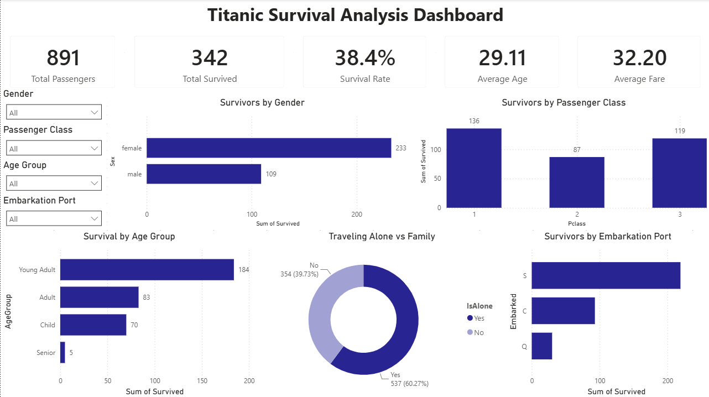
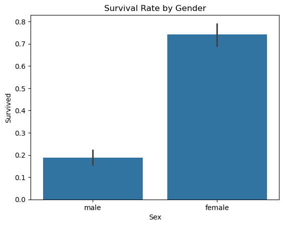
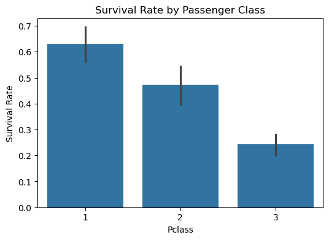
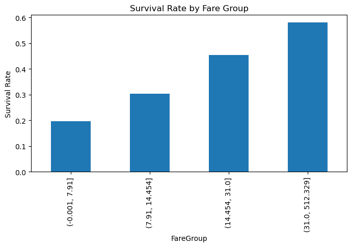
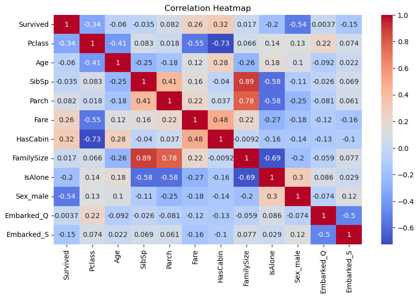
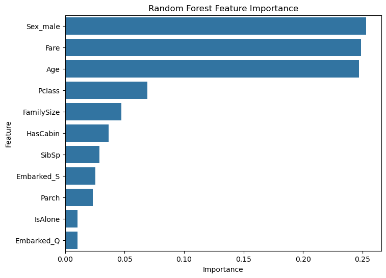

# 🚢 Titanic Survival Prediction using Machine Learning & Power BI

## 📌 Project Overview

This project analyzes the Titanic disaster dataset to identify the factors that influenced passenger survival and builds machine learning models to predict survival outcomes.

The project follows a complete Data Science workflow:

- Data Cleaning
- Exploratory Data Analysis (EDA)
- Feature Engineering
- Data Preprocessing
- Machine Learning Model Development
- Model Evaluation
- Power BI Dashboard Creation
- Kaggle Submission

The final solution combines Python-based analysis with an interactive Power BI dashboard to generate actionable insights from the Titanic dataset.

---

## 🛠️ Skills Demonstrated

### Data Analysis
- Python
- Pandas
- NumPy
- Data Cleaning
- Missing Value Handling
- Exploratory Data Analysis (EDA)
- Feature Engineering

### Data Visualization
- Matplotlib
- Seaborn
- Power BI
- Dashboard Design
- KPI Reporting

### Machine Learning
- Logistic Regression
- Decision Tree
- Random Forest
- Model Evaluation
- Feature Importance Analysis

---

# 📂 Dataset Information

Dataset Source:

Titanic Dataset (Kaggle)

Total Records:

- 891 Passengers

Target Variable:

| Value | Meaning |
|---------|---------|
| 0 | Did Not Survive |
| 1 | Survived |

---

## Features Used

| Feature | Description |
|----------|-------------|
| Pclass | Passenger Class |
| Sex | Passenger Gender |
| Age | Passenger Age |
| SibSp | Number of Siblings/Spouses |
| Parch | Number of Parents/Children |
| Fare | Ticket Fare |
| Cabin | Cabin Information |
| Embarked | Port of Embarkation |

---

# 🧹 Data Cleaning

## Missing Values Handling

### Age

- 177 missing values
- Filled using median age grouped by Passenger Class and Gender

### Embarked

- 2 missing values
- Filled using mode

### Cabin

- Large number of missing values
- Created a binary feature:

```text
HasCabin
```

- Original Cabin column removed

---

## Removed Columns

```text
PassengerId
Name
Ticket
Cabin
```

---

# ⚙️ Feature Engineering

## FamilySize

```python
FamilySize = SibSp + Parch + 1
```

---

## IsAlone

Binary Feature:

| Value | Meaning |
|---------|---------|
| 1 | Traveling Alone |
| 0 | Traveling With Family |

---

## HasCabin

Binary Feature:

| Value | Meaning |
|---------|---------|
| 1 | Cabin Information Available |
| 0 | Missing Cabin Information |

---

# 📊 Exploratory Data Analysis

## Survival Rate by Gender

| Gender | Survival Rate |
|---------|--------------|
| Female | 74.20% |
| Male | 18.89% |

### Insight

Female passengers survived significantly more often than male passengers.

---

## Survival Rate by Passenger Class

| Class | Survival Rate |
|---------|--------------|
| 1st Class | 62.96% |
| 2nd Class | 47.28% |
| 3rd Class | 24.24% |

### Insight

Passengers traveling in higher classes had better chances of survival.

---

## Survival Rate by Age Group

| Age Group | Survival Rate |
|------------|--------------|
| 0-12 | 57.97% |
| 12-18 | 42.86% |
| 18-35 | 35.80% |
| 35-60 | 38.43% |
| 60+ | 22.73% |

### Insight

Children had the highest survival rates while elderly passengers had the lowest.

---

## Survival Rate by Fare Group

| Fare Range | Survival Rate |
|------------|--------------|
| 0 – 7.91 | 19.73% |
| 7.91 – 14.45 | 30.36% |
| 14.45 – 31.00 | 45.50% |
| Above 31.00 | 58.11% |

### Insight

Higher fare-paying passengers generally had better survival outcomes.

---

# 📈 Power BI Dashboard

An interactive dashboard was created using Power BI to explore survival patterns dynamically.

## Dashboard Features

### KPI Cards

- Total Passengers
- Total Survived
- Survival Rate
- Average Age
- Average Fare

### Interactive Filters

- Gender
- Passenger Class
- Age Group
- Embarkation Port

### Visualizations

- Survivors by Gender
- Survivors by Passenger Class
- Survival by Age Group
- Traveling Alone vs Family
- Survivors by Embarkation Port

---

## Dashboard Preview



---

# 📸 Additional Visualizations

## Survival Rate by Gender



---

## Survival Rate by Passenger Class



---

## Survival Rate by Fare Group



---

## Correlation Heatmap



---

## Random Forest Feature Importance



---

# 🔄 Data Preprocessing

## One-Hot Encoding

Categorical variables converted into numerical features:

```text
Sex_male
Embarked_Q
Embarked_S
```

---

## Train-Test Split

```text
Training Set : 80%
Testing Set  : 20%
```

Training Samples:

```text
712
```

Testing Samples:

```text
179
```

---

# 🤖 Machine Learning Models

## Logistic Regression

Accuracy:

```text
81.01%
```

---

## Decision Tree

Accuracy:

```text
78.21%
```

---

## Random Forest

Accuracy:

```text
82.68%
```

---

# 📊 Model Comparison

| Model | Accuracy |
|----------|---------|
| Logistic Regression | 81.01% |
| Decision Tree | 78.21% |
| Random Forest | 82.68% |

---

# 🏆 Best Performing Model

## Random Forest Classifier

Accuracy:

```text
82.68%
```

Random Forest achieved the highest predictive performance and provided strong feature importance insights.

---

# 📊 Random Forest Feature Importance

| Feature | Importance |
|-----------|----------|
| Sex_male | 0.2531 |
| Fare | 0.2487 |
| Age | 0.2472 |
| Pclass | 0.0690 |
| FamilySize | 0.0472 |
| HasCabin | 0.0366 |
| SibSp | 0.0289 |
| Embarked_S | 0.0253 |
| Parch | 0.0231 |
| IsAlone | 0.0106 |
| Embarked_Q | 0.0104 |

---

# 🔍 Key Findings

- Female passengers had substantially higher survival rates.
- First-class passengers survived more frequently.
- Higher fare-paying passengers had better chances of survival.
- Children had better survival outcomes than elderly passengers.
- Cabin information strongly correlated with survival.
- Gender, Fare, Age, and Passenger Class were the most influential predictors.

---

# 🏅 Kaggle Competition Submission

Generated prediction file:

```text
submission.csv
```

Format:

```text
PassengerId,Survived
892,0
893,1
894,0
...
```

---

# 📁 Repository Structure

```text
Titanic-Survival-Prediction/
│
├── dashboards/
│   └── Titanic Survival Analysis.pbix
│
├── datasets/
│   ├── train.csv
│   ├── test.csv
│   ├── gender_submission.csv
│   └── titanic_cleaned.csv
│
├── images/
│   ├── Titanic_dashboard.png
│   ├── gender_survival.png
│   ├── pclass_survival.png
│   ├── fare_survival.png
│   ├── correlation_heatmap.png
│   └── feature_importance.png
│
├── Titanic_Survival_Prediction.ipynb
├── submission.csv
├── requirements.txt
└── README.md
```

---

# 🚀 Future Improvements

- Hyperparameter Tuning
- Cross Validation
- XGBoost Implementation
- Streamlit Deployment
- Power BI Multi-Page Dashboard
- Model Deployment with Flask/FastAPI

---

# 📚 Libraries Used

```text
pandas
numpy
matplotlib
seaborn
scikit-learn
jupyter
powerbi
```

---

# 👨‍💻 Author

### Ankush Kumar Singh

B.Tech CSE (Data Science)

Passionate about:
- Data Analysis
- Machine Learning
- Data Visualization
- Power BI
- Problem Solving

---